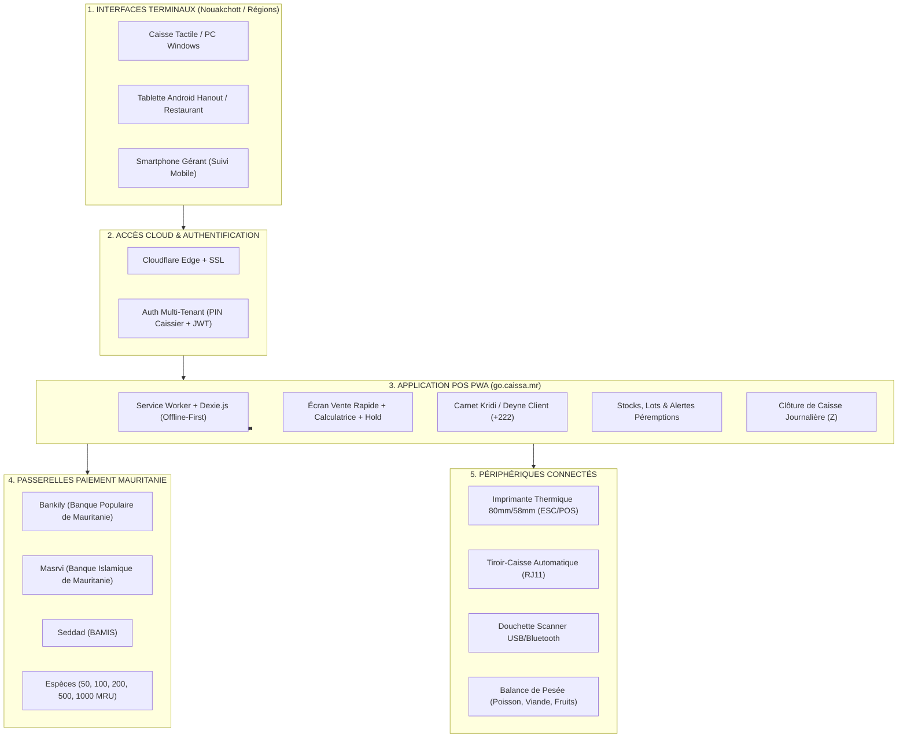

# ARCHITECTURE SYSTÈME & CAHIER DES CHARGES TECHNIQUE
# CAISSA MAURITANIE (CAISSA.MR) – SOLUTION POS & SAAS POUR LA MAURITANIE
*Adaptation intégrale du modèle Caissa.tn au marché, aux paiements et à la fiscalité mauritanienne*

---

## 1. VISION DU PRODUIT & ADAPTATION AU MARCHÉ MAURITANIEN

### 1.1 Contexte Commercial & Économique en Mauritanie
Le marché du commerce de détail et de la restauration en Mauritanie (Nouakchott, Nouadhibou, Rosso, Kiffa, etc.) connaît une digitalisation accélérée, portée par :
1. **L'adoption massive du Mobile Money :** Contrairement au modèle bancaire classique, les Mauritaniens utilisent massivement **Bankily** (BPM), **Masrvi** (BIM), **Seddad** (BAMIS) et **Click** (Al Amana) au quotidien pour régler leurs achats, même chez les petits commerçants de quartier (*Hanout*).
2. **Le système du Carnet de Crédit (*« الكريدي » / « الدين » - Deyne*) :** C'est le pilier du commerce de proximité en Mauritanie. Le commerçant accorde du crédit à ses clients réguliers jusqu'à la paie de fin de mois. Un logiciel qui n'intègre pas le Kridi avec gestion des plafonds et relances par SMS/WhatsApp est inadapté au marché mauritanien.
3. **La nouvelle monnaie (MRU) :** En vigueur depuis 2018 (1 MRU = 10 anciennes Ouguiyas MRO). Toutes les transactions et tickets doivent afficher les montants en **MRU**.
4. **Coupures de billets mauritaniens :** Les billets en circulation sont de **50 MRU, 100 MRU, 200 MRU, 500 MRU et 1000 MRU**.
5. **Cadre fiscal mauritanien (CGI) :**
   - **NIF (Numéro d'Identification Fiscale) :** Mention légale obligatoire sur chaque ticket et facture.
   - **TVA à 16% :** Taux de TVA standard en vigueur en République Islamique de Mauritanie.
   - Facturation et tickets bilingues (Arabe / Français).

---

## 2. MACRO-ARCHITECTURE SYSTÈME POUR LA MAURITANIE



---

## 3. SPÉCIFICATIONS DES ÉCRANS & EXPÉRIENCE UTILISATEUR

### 3.1 Écran POS (Point de Vente Tactile Adapté Mauritanie)
1. **Devise & Affichage :** Montants affichés en **MRU** (ex: `150 MRU`, `1 250 MRU`).
2. **Recherche & Scan Code-barres :**
   - Détection automatique de la douchette USB/Bluetooth.
   - Saisie rapide par désignation en Français ou en Arabe (*« Riz Mauritanien 5kg »*, *« Thé Al-Warka »*, *« Lait Gloria »*).
3. **Support des Produits au Poids (Pesée Balance) :**
   - Crucial pour les boucheries (*Chwaya*, viande de chameau et agneau) et poissonneries de Nouakchott/Nouadhibou (*Thiof*, *Courbine*, *Sardine*).
   - Calcul automatique : $\text{Prix} = \text{Poids (Kg)} \times \text{Prix au Kg (MRU)}$.
4. **Bouton « Ticket en attente » (Suspend / Hold Ticket) :**
   - Mise en attente d'un panier en cours et bascule immédiate vers un autre client.
   - Liste des tickets suspendus avec compteur visuel.
5. **Calculatrice Intégrée Tactile :**
   - Clavier numérique accessible en 1 clic pour effectuer des calculs ou ajouter des montants divers libres.
6. **Modal d'Encaissement Adapté aux Moyens Mauritaniens :**
   - **Espèces (Cash MRU) :**
     - Raccourcis billets : **`[50 MRU]` `[100 MRU]` `[200 MRU]` `[500 MRU]` `[1000 MRU]` `[Montant Exact]`**.
     - Calcul grand format du rendu de monnaie en MRU.
   - **Bankily (BPM) :** Enregistrement de la référence de transaction ou saisie du numéro de téléphone client (+222) pour paiement push/code QR.
   - **Masrvi (BIM) :** Enregistrement de la référence de transaction.
   - **Seddad (BAMIS) / Click :** Support multi-portefeuilles.
   - **Vente à Crédit (*البيع بالكريدي*) :** Sélection du client mauritanien avec contrôle du plafond de dette.
7. **Ticket de Caisse Conforme Mauritanie :**
   - Format 80 mm ou 58 mm.
   - En-tête : Nom du commerce, Ville (ex: *Tevragh-Zeina, Nouakchott*), Téléphone (+222), **NIF (Numéro d'Identification Fiscale)**.
   - Ventilation TVA : Total HT, **TVA 16%**, Total TTC en MRU.
   - Mention de bas de ticket en Français et en Arabe (*« Merci pour votre visite - شكراً لزيارتكم »*).

---

### 3.2 Écran Carnet de Crédit (*« Kridi » - البيع بالكريدي*)
1. **Fiche Client Mauritanie :**
   - Nom complet (ex: *Cheikh Ould Sidi*, *Fatimetou Mint Mohamed*).
   - Téléphone mauritanien (format 8 chiffres : `22 XX XX XX`, `36 XX XX XX`, `44 XX XX XX`).
   - Numéro National d'Identification (NNI - 10 chiffres).
   - Quartier / Adresse (ex: *Ilot K, Nouakchott*).
   - **Plafond de Crédit Autorisé en MRU** (ex: `5 000 MRU`).
   - **Dette Actuelle en MRU**.
2. **Historique des Transactions :**
   - Achats à crédit détaillés par ticket.
   - Règlements reçus (Espèces, Bankily, Masrvi).
   - Reçu d'acompte imprimable avec solde restant.

---

### 3.3 Écran Clôture de Caisse (Rapport Z Journalier)
- Clôture journalière avec comptage des billets mauritaniens (**50, 100, 200, 500, 1000 MRU**).
- Récapitulatif :
  - Total Espèces en caisse.
  - Total encaissé via **Bankily**.
  - Total encaissé via **Masrvi / Autres**.
  - Total Ventes à Crédit (Kridi).
  - Écart de caisse (+ / - MRU).
  - Base imposable et TVA 16% collectée.

---

### 3.4 Écran Tarification & Abonnement SaaS Mauritanie
- **Formule Journalière Flexible :**
  - Tarif standard : **15 MRU / jour**.
  - 3 mois (90 jours) : **-10%** (13.5 MRU/j).
  - 6 mois (180 jours) : **-30%** (10.5 MRU/j).
  - 1 an (365 jours) : **-50% (7.5 MRU / jour)**, soit 2 737.5 MRU / an.
  - Période d'essai gratuit de **15 jours**.
- **Moyens de Paiement pour l'Abonnement :**
  - **Paiement direct par Bankily** (numéro marchand / QR Code instantané).
  - **Masrvi** ou Virement bancaire.

---

## 4. SCHÉMA DE BASE DE DONNÉES POSTGRESQL MULTI-TENANT (VERSION MAURITANIE)

```sql
-- 1. TENANTS / COMMERCES MAURITANIENS
CREATE TABLE tenants (
    id UUID PRIMARY KEY DEFAULT gen_random_uuid(),
    business_name VARCHAR(150) NOT NULL,
    sector VARCHAR(50) NOT NULL,          -- 'alimentaire', 'boutique', 'restaurant', 'poissonnerie', 'chwaya', etc.
    nif_number VARCHAR(50),               -- Numéro d'Identification Fiscale Mauritanie (ex: NIF-12345678)
    phone VARCHAR(30) NOT NULL,           -- Format +222 XX XX XX XX
    email VARCHAR(120) UNIQUE NOT NULL,
    address TEXT,                         -- Quartier / Rue
    city VARCHAR(60) DEFAULT 'Nouakchott', -- Nouakchott, Nouadhibou, Rosso, Kiffa
    currency VARCHAR(10) DEFAULT 'MRU',   -- Ouguiya Mauritanienne
    default_vat_rate NUMERIC(5, 2) DEFAULT 16.00, -- TVA 16% Mauritanie
    bankily_merchant_number VARCHAR(30),  -- Numéro marchand Bankily pour encaissements
    masrvi_number VARCHAR(30),
    trial_ends_at TIMESTAMP WITH TIME ZONE NOT NULL,
    subscription_status VARCHAR(30) DEFAULT 'TRIAL',
    created_at TIMESTAMP WITH TIME ZONE DEFAULT NOW()
);

-- 2. CLIENTS & CARNET KRIDI (MAURITANIE)
CREATE TABLE customers (
    id UUID PRIMARY KEY DEFAULT gen_random_uuid(),
    tenant_id UUID REFERENCES tenants(id) ON DELETE CASCADE,
    full_name VARCHAR(150) NOT NULL,
    phone VARCHAR(30) NOT NULL,           -- +222
    nni VARCHAR(20),                      -- Numéro National d'Identification (10 chiffres)
    address TEXT,                         -- Ex: Tevragh-Zeina, Ksar, Sebkha
    credit_limit NUMERIC(12, 2) NOT NULL DEFAULT 5000.00, -- Plafond en MRU
    current_debt NUMERIC(12, 2) NOT NULL DEFAULT 0.00,
    created_at TIMESTAMP WITH TIME ZONE DEFAULT NOW()
);

-- 3. VENTES & TICKETS (EN MRU)
CREATE TABLE orders (
    id UUID PRIMARY KEY DEFAULT gen_random_uuid(),
    tenant_id UUID REFERENCES tenants(id) ON DELETE CASCADE,
    store_id UUID,
    shift_id UUID,
    cashier_id UUID,
    customer_id UUID REFERENCES customers(id),
    ticket_number VARCHAR(30) NOT NULL,
    subtotal_ht NUMERIC(12, 2) NOT NULL,
    total_vat NUMERIC(12, 2) NOT NULL,    -- 16% TVA
    discount_amount NUMERIC(12, 2) DEFAULT 0,
    total_ttc NUMERIC(12, 2) NOT NULL,    -- Total en MRU
    payment_method VARCHAR(30) NOT NULL,  -- 'CASH', 'BANKILY', 'MASRVI', 'KRIDI', 'MIXED'
    payment_reference VARCHAR(100),       -- Réf transaction Bankily / Masrvi
    cash_given NUMERIC(12, 2) DEFAULT 0,
    cash_change NUMERIC(12, 2) DEFAULT 0,
    status VARCHAR(20) DEFAULT 'COMPLETED',
    is_synced BOOLEAN DEFAULT TRUE,
    created_at TIMESTAMP WITH TIME ZONE DEFAULT NOW()
);
```

---

*Spécifications approuvées pour déploiement immédiat de la version Mauritanie.*
