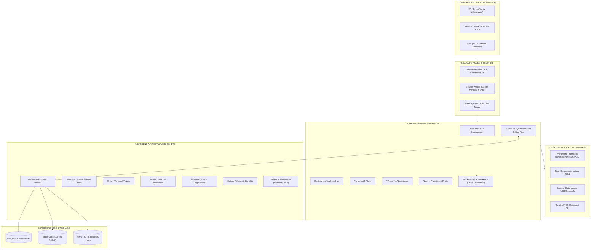
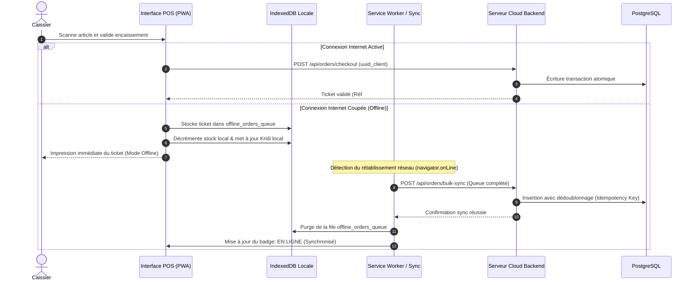

# ARCHITECTURE SYSTÈME & SPÉCIFICATIONS TECHNIQUES
# RÉPLIQUE EXACTE DU MODÈLE CAISSA.TN (POINT DE VENTE & GESTION SAAS)

> **Document de Référence Technique & Fonctionnelle**  
> **Cible :** Reproduction fidèle à 100% de la solution **Caissa.tn** (Plateforme Vitrine, Application Caisse POS, Back-Office Cloud, Moteur Hors-Ligne, Gestion Multi-Secteurs et Facturation SaaS en Tunisie).

---

## 1. ANALYSE EXHAUSTIVE DE L'ÉCOSYSTÈME CAISSA.TN

Après audit technique approfondi du code source, des flux réseau, des métadonnées PWA et des interfaces de **Caissa.tn**, la solution repose sur une infrastructure découpée en **3 piliers complémentaires** :

```
                        ÉCOSYSTÈME GLOBAL CAISSA.TN
   ┌───────────────────────────────┬───────────────────────────────┐
   │                               │                               │
   ▼                               ▼                               ▼
[1. caissa.tn]             [2. sec.caissa.tn]               [3. go.caissa.tn]
Portail Public Vitrine     Serveur d'Authentification       Application Métier POS &
- Landing page dynamique   - Keycloak OIDC / OAuth2         Back-Office SaaS
- Présentation secteurs    - Gestion des Realms             - PWA Offline-First
- Calculateur de prix      - Tokens JWT sécurisés           - Caisse tactile & TPE
- Chatbot vocal IA         - Contrôle des rôles             - Gestion stocks & Kridi
- Vidéos tutos & FAQ                                        - Clôtures Z & Rapports
```

### 1.1 Composant 1 : Portail Vitrine Public (`caissa.tn`)
- **Rôle :** Acquisition commerciale, réassurance, conversion et onboarding client.
- **Identité visuelle :** Thème double (Clair / Sombre avec switch instantané), typographies *Montserrat* (titres), *Roboto* (corps) et *Noto Sans Arabic* (arabe).
- **Éléments clés :**
  - **Bandeau promotionnel supérieur persistant** avec compte à rebours interactif (*-50% sur abonnements*).
  - **Hero Section :** Accroche tunisienne (*« Caisse enregistreuse Intelligente - أحسن نظام لتسيير المحلات ونقاط البيع في تونس »*), tarif d'appel (*Dès 0.5 DT/jour*), statistiques de confiance (*500+ Clients, 15 Jours Gratuits, Support 24/7*).
  - **9 Secteurs d'activité préconfigurés :** Drugstore/Supérette, Parfumerie & Cosmétiques, Parapharmacie, Librairie, Pet Store (Animalerie), Café - Restaurant, Fromagerie (poids/vrac), Grossiste, Magasin fermier (El Mazraa).
  - **6 Services phares détaillés :** Gestion des travailleurs, Gestion des stocks, Vente au crédit (*البيع بالكريدي*), Statistiques financières, Tarifs journaliers, Tickets & TPE.
  - **Onglets interactifs POS & Démo :** Vues animées des écrans POS, Ventes, Stocks, Dashboard, TPE & Multi-utilisateurs.
  - **Calculateur de tarification dynamique avec Slider :**
    - Durée de 1 à 365 jours.
    - Tarif de base : **1.000 DT / jour**.
    - Jalons de remise : **90 jours (-10%)**, **180 jours (-30%)**, **365 jours (-50% soit 500 millimes/jour)**.
    - Période d'essai gratuit de **15 jours sans carte bancaire**.
  - **Caissa Assistant (Chatbot flottant) :** Support FAQ interactif avec reconnaissance vocale (*Web Speech Recognition*) et synthèse vocale (*Web Speech Synthesis*).

### 1.2 Composant 2 : Authentification Sécurisée (`sec.caissa.tn`)
- **Technologie :** Serveur Keycloak (OpenID Connect / OAuth2 PKCE).
- **Fonctionnement :**
  - Cloisonnement par Realm (`caissaTnRealm`).
  - Gestion des profils : Administrateur boutique, Gérant de succursale, Caissier / Vendeur, Serveur.
  - Attribution de sessions sécurisées avec rafraîchissement silencieux de token.

### 1.3 Composant 3 : L'Application Caisse & Gestion (`go.caissa.tn`)
- **Technologie :** Application Web Progressive (PWA) monopage (SPA) avec Service Worker, Cache Manifest et stockage local.
- **Palette de design :**
  - Primaire : `#254962` (Bleu Caissa Institutionnel).
  - Succès / Encaissé : `#1cbb8c` (Vert émeraude).
  - Attention / Kridi : `#fcb92c` (Ambre/Orange).
  - Alerte / Rupture : `#ff3d60` (Rouge vif).
  - Neutre / Fond : `#f8f9fa` (Mode clair) ou `#1e293b` / `#252b3b` (Mode sombre).
- **Navigation :**
  - **Sidebar gauche fixe / repliable** (Largeur 240px dépliée, 70px repliée).
  - **Topbar supérieure (70px) :** Recherche rapide, sélection de la caisse active, nom de la boutique, statut réseau temps réel (Badge Vert En Ligne / Orange Hors Ligne), notifications et profil.

---

## 2. MACRO-ARCHITECTURE DU SYSTÈME



---

## 3. SPÉCIFICATIONS FONCTIONNELLES EXACTES (ÉCRAN PAR ÉCRAN)

### 3.1 Écran 1 : Tableau de Bord & Statistiques (Dashboard)
Cet écran offre au propriétaire et au gérant une vue panoramique instantanée de la santé de son commerce.

1. **Cartes d'Indicateurs Clés (KPI Cards) :**
   - **Chiffre d'Affaires du Jour :** Total encaissé en DT (ex: `1 450.800 DT`), comparaison avec la veille (+12.4%).
   - **Bénéfice Net Estimé :** Calcul en temps réel : $\text{Prix de vente TTC} - \text{Prix de revient d'achat} - \text{TVA}$.
   - **Nombre de Transactions :** Nombre total de tickets générés et panier moyen (ex: `18.250 DT / ticket`).
   - **Total Créances Kridi :** Montant total des dettes clients en attente de recouvrement.
   - **Alertes Stocks Faibles :** Nombre d'articles ayant atteint ou dépassé leur seuil critique.
2. **Graphiques Temps Réel :**
   - Courbe des ventes par tranche horaire (détection des heures de pointe : 11h-14h et 18h-21h).
   - Diagramme circulaire des modes de paiement (Espèces %, Carte/TPE %, Kridi %, Chèque %).
3. **Tableau des Top Ventes :**
   - Top 10 des produits les plus vendus avec quantité, CA généré et marge.
4. **Activité des Caissiers :**
   - Chiffre réalisé par caissier en service et écart de caisse en cours.

---

### 3.2 Écran 2 : Le Point de Vente Tactile (POS Caisse Enregistreuse)
Le cœur battant du magasin, conçu pour une exécution ultra-rapide (moins de 3 secondes par transaction).

```
+----------------------------------------------------------------------------------------------------+
|  [Logo Caissa]  Magasin: Supérette El Baraka | Caisse #01 | Caissier: Riadh [PIN] | [ONLINE] 14:32  |
+----------------------------------------------------------------------------------------------------+
|  CATÉGORIES                  |  GRILLE DES ARTICLES                   |  TICKET EN COURS (PANIER)  |
|  [Toutes]                    |  [Recherche / Scan code-barre......]   |  Client: Comptoir [Changer]|
|  [Alimentation]              |  +----------------+ +----------------+ |  ------------------------- |
|  [Boissons]                  |  | Eau Minérale   | | Lait 1L        | |  1x Eau Minérale   0.900 DT|
|  [Produits Frais]            |  | 0.900 DT       | | 1.450 DT       | |  2x Lait 1L        2.900 DT|
|  [Entretien]                 |  | Stock: 45      | | Stock: 12      | |  1x Fromage Vrac   4.500 DT|
|  [Snacks]                    |  +----------------+ +----------------+ |     (0.300 kg x 15.000 DT) |
|  [Tabac & Presse]            |  | Fromage Vrac   | | Café Espresso  | |  ------------------------- |
|                              |  | 15.000 DT / kg | | 2.200 DT       | |  Sous-Total:       8.300 DT|
|                              |  | [Balance KG]   | | Stock: 99      | |  Remise (0%):      0.000 DT|
|                              |  +----------------+ +----------------+ |  Timbre Fiscal:    1.000 DT|
|                              |                                        |  TOTAL TTC:        9.300 DT|
|                              |  [ 1 ] [ 2 ] [ 3 ] [ C ]               |  ------------------------- |
|                              |  [ 4 ] [ 5 ] [ 6 ] [ Calculatrice ]    |  [ Mettre en Attente ]     |
|                              |  [ 7 ] [ 8 ] [ 9 ] [ 0 ] [ . ]         |  [ Tickets Suspendus (2) ] |
|                              |                                        |  ========================= |
|                              |                                        |  [ ENCAISSER (9.300 DT) ]  |
+----------------------------------------------------------------------------------------------------+
```

#### Détail des Fonctionnalités POS :
1. **Recherche & Scan Code-barres :**
   - Champ de saisie actif en permanence écoutant la douchette USB/Bluetooth.
   - Scan direct d'un code EAN-13 -> Ajout immédiat au ticket avec incrémentation automatique de la quantité si le produit y est déjà.
2. **Articles au Poids (Pesée Balance) :**
   - Pour les commerces de détail (fromagerie, primeur, boucherie) : saisie du poids manuel en kg (ex: `0.350`) ou lecture directe de balance RS232/USB.
3. **Bouton « Ticket en attente » (Suspend / Hold Ticket) :**
   - Si un client a oublié son portefeuille ou retourne chercher un article, le caissier clique sur « Mettre en attente ».
   - Le ticket est sauvegardé dans la liste locale des tickets suspendus avec horodatage.
   - Le caissier encaisse le client suivant sans perdre la saisie du premier.
   - Reprise en un clic du ticket suspendu dès que le client revient.
4. **Calculatrice Intégrée :**
   - Pavé numérique virtuel permettant de faire un calcul rapide de tête ou d'entrer directement un montant libre (article divers non répertorié).
5. **Modal d'Encaissement Multi-Moyens :**
   - **Espèces (Cash) :**
     - Saisie rapide du montant donné par le client avec raccourcis billets tunisiens : **`[5 DT]` `[10 DT]` `[20 DT]` `[50 DT]` `[Montant Exact]`**.
     - Calcul dynamique et géant du rendu de monnaie : $\text{Rendu} = \text{Montant Donné} - \text{Total TTC}$.
   - **TPE (Carte Bancaire) :** Enregistrement direct de la transaction TPE.
   - **Vente à Crédit (« Kridi ») :**
     - Sélection obligatoire d'un client dans le carnet.
     - Affichage du solde actuel de dette et de son plafond autorisé.
     - Blocage automatique si le nouveau montant dépasse le plafond (déblocage uniquement par code PIN Administrateur).
   - **Paiement Mixte / Fractionné :** Possibilité d'encaisser par exemple 10 DT en espèces et le reste en Carte TPE ou Kridi.
6. **Impression du Ticket de Caisse Thermique :**
   - Format 80 mm ou 58 mm standard.
   - En-tête : Nom du commerce, Matricule Fiscal, Adresse, Téléphone.
   - Corps : Date, Heure, Numéro de ticket séquentiel, Nom du caissier, Détail des articles, Prix unitaire, Quantité, Montant.
   - Pied : Sous-total HT, TVA ventilée, Timbre fiscal (1.000 DT), Total TTC en Dinars Tunisiens, Mode de règlement et Rendu.
   - Message de bienvenue ou remerciement paramétrable (*« Merci pour votre visite ! »*).
   - Déclenchement automatique de l'ouverture du tiroir-caisse via impulsion ESC/POS.

---

### 3.3 Écran 3 : Gestion du Crédit Client (« Carnet Kridi » - البيع بالكريدي)
Fonctionnalité indispensable pour le commerce de proximité en Tunisie (épiceries, boucheries, quincailleries, cafés).

1. **Répertoire des Clients Kridi :**
   - Nom complet, Téléphone, Numéro CIN, Adresse, Date de création.
   - **Plafond de Crédit Autorisé (DT) :** Montant maximal de dette autorisé (ex: `150.000 DT`).
   - **Solde Actuel Dû (DT) :** Solde débiteur recalculé à chaque achat et chaque acompte.
   - **Statut de Risque :** Vert (Dans la limite), Orange (Proche du plafond), Rouge (Plafond dépassé / En retard).
2. **Fiche Détail Client (Relevé de Compte) :**
   - Historique chronologique de toutes les opérations :
     - Date & Heure.
     - Type d'opération : Achat ticket #0045 (+24.500 DT) ou Règlement acompte (-20.000 DT).
     - Solde résultant.
     - Nom du caissier ayant validé l'opération.
3. **Module de Règlement d'Acompte / Paiement de Dette :**
   - Bouton « Encaisser un Règlement ».
   - Saisie du montant payé par le client (espèces, chèque ou virement).
   - Génération et impression d'un **Reçu de Règlement de Crédit** pour le client mentionnant : *Ancien Solde, Montant Versé, Nouveau Solde Restant*.

---

### 3.4 Écran 4 : Gestion des Stocks & Catalogue Articles
1. **Fiche Produit Complète :**
   - Désignation de l'article (ex: *« Huile d'Olive Vierge 1L »*).
   - Code-barres EAN-13 (générable automatiquement ou scannable).
   - Catégorie & Sous-catégorie.
   - Marque & Fournisseur attitré.
   - **Prix d'Achat HT / TTC (Coût de revient)** : accessible uniquement aux gérants/admins.
   - **Prix de Vente TTC** en Dinars Tunisiens.
   - **Taux de TVA applicable :** 0%, 7%, 13% ou 19%.
   - **Quantité en Stock :** Nombre d'unités ou poids en Kg.
   - **Seuil d'Alerte Minimum :** Déclenche un badge orange/rouge dès qu'il est atteint.
   - **Gestion des Lots & Dates de Péremption (DLC) :** Suivi des dates limites pour les produits périssables (fromagerie, parapharmacie, yaourts) avec alerte 7 jours avant expiration.
2. **Mouvements de Stock :**
   - Entrée de marchandises (Réception bon de livraison fournisseur avec mise à jour du prix d'achat).
   - Sortie manuelle (Perte, casse, consommation personnelle).
   - Inventaire physique régulier avec calcul d'écarts de stock.
3. **Générateur & Impression d'Étiquettes Code-barres :**
   - Modèles d'étiquettes de rayon et d'étiquettes adhésives produits (Format standard 38x25mm ou A4 multi-planches).

---

### 3.5 Écran 5 : Clôture de Caisse & Rapports Fiscaux (Z et X)
1. **Rapport X (Intermédiaire en cours de journée) :**
   - Consultation des totaux à l'instant T sans fermer la caisse.
2. **Rapport Z (Clôture journalière officielle obligatoire) :**
   - Déclenchée en fin de service ou en fin de journée par le gérant.
   - **Comptage Physique de Caisse (Contrôle à l'aveugle) :**
     - Le caissier compte et saisit le nombre de pièces et de billets présents dans le tiroir.
     - Le système calcule la différence avec le montant théorique attendu :
       $$\text{Écart de Caisse} = \text{Espèces Réelles} - (\text{Fond de caisse initial} + \text{Total Ventes Espèces} - \text{Dépenses sorties})$$
     - Indication : *Caisse Juste*, *Excédent de Caisse (+X DT)* ou *Déficit de Caisse (-X DT)*.
   - Récapitulatif ventilé des encaissements : Total Espèces, Total TPE, Total Chèques, Total Ventes au Kridi, Total Règlements Kridi reçus.
   - Récapitulatif TVA (Base HT et montant TVA par taux : 7%, 13%, 19%).
   - Impression du ticket Z officiel et archivage inaltérable en base.

---

### 3.6 Écran 6 : Gestion des Travailleurs & Permissions
1. **Gestion des Utilisateurs :**
   - Création des comptes caissiers avec Nom, Identifiant et **Code PIN à 4 chiffres**.
   - Le code PIN permet de basculer instantanément d'un caissier à un autre sur le même écran POS sans retaper de mot de passe long.
2. **Matrice des Rôles & Droits d'Accès :**
   - **Administrateur / Propriétaire :** Accès illimité à tous les modules, bénéfices, configuration fiscale et abonnements.
   - **Gérant de Magasin :** Accès au POS, gestion des stocks, gestion des crédits, clôture Z, sans accès aux paramètres d'abonnement SaaS.
   - **Caissier / Vendeur :** Accès exclusif à la vente POS et mise en attente. Droits restreints :
     - *Interdiction de voir le bénéfice ou les prix d'achat*.
     - *Interdiction d'accorder une remise supérieure à X% sans PIN superviseur*.
     - *Interdiction de supprimer un article après validation du ticket*.
     - *Interdiction d'annuler une vente passée*.

---

### 3.7 Écran 7 : Gestion de l'Abonnement SaaS (Billing & Licences)
Conforme au modèle exact de tarification flexible de Caissa.tn.

1. **Statut de l'Abonnement Actuel :**
   - Type de plan : *Période d'essai gratuit (15 jours)* ou *Abonnement Actif*.
   - Compteur visuel des jours restants avant expiration.
   - Message d'alerte à J-3 pour renouveler.
2. **Sélecteur de Durée d'Abonnement (Slider Dynamique 1 à 365 jours) :**
   - Règle de calcul :
     - De 1 à 89 jours : **1.000 DT / jour** (Tarif plein).
     - De 90 à 179 jours : **-10% de remise** (0.900 DT / jour).
     - De 180 à 364 jours : **-30% de remise** (0.700 DT / jour).
     - À partir de 365 jours (Annuel) : **-50% de remise (500 millimes / jour)** soit 182.500 DT / an au lieu de 365 DT.
3. **Moyens de Paiement Intégrés :**
   - Passerelles tunisiennes : **Konnect**, **Flouci**, **GPG Checkout** (Paiement par carte bancaire CIB, e-Dinar de la Poste Tunisienne, virement instantané).
   - Génération automatique de la facture acquittée téléchargeable en PDF.

---

## 4. SCHÉMA DE BASE DE DONNÉES POSTGRESQL MULTI-TENANT

Le schéma ci-dessous garantit l'étanchéité absolue des données entre chaque commerce abonné via un champ `tenant_id` systématique.

```sql
-- 1. ORGANISATIONS / COMMERCES ABONNÉS (TENANTS)
CREATE TABLE tenants (
    id UUID PRIMARY KEY DEFAULT gen_random_uuid(),
    business_name VARCHAR(150) NOT NULL,
    sector VARCHAR(50) NOT NULL, -- 'drugstore', 'parfumerie', 'restaurant', 'grossiste', etc.
    tax_number VARCHAR(50),      -- Matricule Fiscal Tunisien (ex: 1234567/A/M/000)
    phone VARCHAR(30) NOT NULL,
    email VARCHAR(120) UNIQUE NOT NULL,
    address TEXT,
    city VARCHAR(60) DEFAULT 'Tunis',
    currency VARCHAR(10) DEFAULT 'TND',
    fiscal_stamp NUMERIC(10, 3) DEFAULT 1.000, -- Timbre fiscal tunisien 1.000 DT
    trial_ends_at TIMESTAMP WITH TIME ZONE NOT NULL,
    subscription_status VARCHAR(30) DEFAULT 'TRIAL', -- 'TRIAL', 'ACTIVE', 'EXPIRED'
    created_at TIMESTAMP WITH TIME ZONE DEFAULT NOW()
);

-- 2. SUCCURSALES / POINTS DE VENTE
CREATE TABLE stores (
    id UUID PRIMARY KEY DEFAULT gen_random_uuid(),
    tenant_id UUID REFERENCES tenants(id) ON DELETE CASCADE,
    name VARCHAR(100) NOT NULL,
    address TEXT,
    phone VARCHAR(30),
    is_main_branch BOOLEAN DEFAULT TRUE,
    created_at TIMESTAMP WITH TIME ZONE DEFAULT NOW()
);

-- 3. CAISSES ENREGISTREUSES PHYSIQUES / POSTES
CREATE TABLE cash_registers (
    id UUID PRIMARY KEY DEFAULT gen_random_uuid(),
    store_id UUID REFERENCES stores(id) ON DELETE CASCADE,
    register_number INT NOT NULL DEFAULT 1,
    name VARCHAR(50) DEFAULT 'Caisse Principale',
    is_active BOOLEAN DEFAULT TRUE
);

-- 4. UTILISATEURS & PERMISSIONS (RBAC)
CREATE TABLE users (
    id UUID PRIMARY KEY DEFAULT gen_random_uuid(),
    tenant_id UUID REFERENCES tenants(id) ON DELETE CASCADE,
    store_id UUID REFERENCES stores(id) ON DELETE SET NULL,
    full_name VARCHAR(100) NOT NULL,
    email VARCHAR(120),
    pin_code VARCHAR(6) NOT NULL, -- Code PIN rapide pour accès caisse
    password_hash VARCHAR(255),
    role VARCHAR(30) NOT NULL,   -- 'SUPERADMIN', 'STORE_MANAGER', 'CASHIER'
    can_give_discount BOOLEAN DEFAULT FALSE,
    max_discount_percent INT DEFAULT 0,
    can_void_item BOOLEAN DEFAULT FALSE,
    can_view_reports BOOLEAN DEFAULT FALSE,
    is_active BOOLEAN DEFAULT TRUE,
    created_at TIMESTAMP WITH TIME ZONE DEFAULT NOW()
);

-- 5. CATÉGORIES ET MARQUES
CREATE TABLE categories (
    id UUID PRIMARY KEY DEFAULT gen_random_uuid(),
    tenant_id UUID REFERENCES tenants(id) ON DELETE CASCADE,
    name VARCHAR(100) NOT NULL,
    color_code VARCHAR(20) DEFAULT '#254962',
    icon VARCHAR(50) DEFAULT 'fas fa-box',
    display_order INT DEFAULT 0
);

CREATE TABLE brands (
    id UUID PRIMARY KEY DEFAULT gen_random_uuid(),
    tenant_id UUID REFERENCES tenants(id) ON DELETE CASCADE,
    name VARCHAR(100) NOT NULL
);

-- 6. PRODUITS & ARTICLES
CREATE TABLE products (
    id UUID PRIMARY KEY DEFAULT gen_random_uuid(),
    tenant_id UUID REFERENCES tenants(id) ON DELETE CASCADE,
    category_id UUID REFERENCES categories(id) ON DELETE SET NULL,
    brand_id UUID REFERENCES brands(id) ON DELETE SET NULL,
    barcode VARCHAR(60), -- Code-barres EAN-13
    sku VARCHAR(60),
    name VARCHAR(150) NOT NULL,
    cost_price NUMERIC(12, 3) NOT NULL DEFAULT 0.000,   -- Prix d'achat HT
    selling_price NUMERIC(12, 3) NOT NULL,              -- Prix de vente TTC
    vat_rate NUMERIC(5, 2) NOT NULL DEFAULT 19.00,      -- 0, 7, 13 ou 19%
    stock_quantity NUMERIC(12, 3) NOT NULL DEFAULT 0,   -- Support des décimales pour les Kg
    alert_threshold NUMERIC(12, 3) NOT NULL DEFAULT 5,  -- Seuil stock mini
    is_weighted BOOLEAN DEFAULT FALSE,                  -- Produit au poids (balance)
    unit VARCHAR(20) DEFAULT 'piece',                   -- 'piece', 'kg', 'litre'
    image_url TEXT,
    is_active BOOLEAN DEFAULT TRUE,
    updated_at TIMESTAMP WITH TIME ZONE DEFAULT NOW()
);

-- 7. GESTION DES LOTS & PÉREMPTIONS
CREATE TABLE product_batches (
    id UUID PRIMARY KEY DEFAULT gen_random_uuid(),
    product_id UUID REFERENCES products(id) ON DELETE CASCADE,
    batch_number VARCHAR(60) NOT NULL,
    expiry_date DATE NOT NULL,
    quantity NUMERIC(12, 3) NOT NULL,
    created_at TIMESTAMP WITH TIME ZONE DEFAULT NOW()
);

-- 8. CLIENTS DU MAGASIN & CARNET KRIDI
CREATE TABLE customers (
    id UUID PRIMARY KEY DEFAULT gen_random_uuid(),
    tenant_id UUID REFERENCES tenants(id) ON DELETE CASCADE,
    full_name VARCHAR(150) NOT NULL,
    phone VARCHAR(30),
    national_id VARCHAR(30),        -- CIN tunisienne
    address TEXT,
    credit_limit NUMERIC(12, 3) NOT NULL DEFAULT 100.000, -- Plafond Kridi
    current_debt NUMERIC(12, 3) NOT NULL DEFAULT 0.000,   -- Dette actuelle
    created_at TIMESTAMP WITH TIME ZONE DEFAULT NOW()
);

-- 9. HISTORIQUE DU CARNET DE DETTE (KRIDI LEDGER)
CREATE TABLE kridi_transactions (
    id UUID PRIMARY KEY DEFAULT gen_random_uuid(),
    tenant_id UUID REFERENCES tenants(id) ON DELETE CASCADE,
    customer_id UUID REFERENCES customers(id) ON DELETE CASCADE,
    order_id UUID,                  -- NULL si c'est un versement libre
    cashier_id UUID REFERENCES users(id),
    transaction_type VARCHAR(20) NOT NULL, -- 'DEBT_ADD' (Achat crédit) ou 'PAYMENT' (Acompte)
    amount NUMERIC(12, 3) NOT NULL,
    balance_after NUMERIC(12, 3) NOT NULL,
    payment_method VARCHAR(30) DEFAULT 'CASH', -- Moyen du règlement reçu
    notes TEXT,
    created_at TIMESTAMP WITH TIME ZONE DEFAULT NOW()
);

-- 10. SESSIONS DE CAISSE (SHIFTS) ET RAPPORTS Z
CREATE TABLE cash_shifts (
    id UUID PRIMARY KEY DEFAULT gen_random_uuid(),
    tenant_id UUID REFERENCES tenants(id) ON DELETE CASCADE,
    register_id UUID REFERENCES cash_registers(id),
    opened_by UUID REFERENCES users(id),
    closed_by UUID REFERENCES users(id),
    opening_cash NUMERIC(12, 3) NOT NULL DEFAULT 50.000, -- Fond de caisse initial
    closing_cash_counted NUMERIC(12, 3),                 -- Montant physique compté
    closing_cash_theoretical NUMERIC(12, 3),             -- Montant calculé
    cash_difference NUMERIC(12, 3),                      -- Écart (+ ou -)
    total_sales_amount NUMERIC(12, 3) DEFAULT 0,
    total_cash_sales NUMERIC(12, 3) DEFAULT 0,
    total_card_sales NUMERIC(12, 3) DEFAULT 0,
    total_kridi_sales NUMERIC(12, 3) DEFAULT 0,
    z_number INT,                                        -- Numéro de rapport Z séquentiel
    opened_at TIMESTAMP WITH TIME ZONE DEFAULT NOW(),
    closed_at TIMESTAMP WITH TIME ZONE,
    status VARCHAR(20) DEFAULT 'OPEN'                    -- 'OPEN', 'CLOSED'
);

-- 11. VENTES & TICKETS (ORDERS)
CREATE TABLE orders (
    id UUID PRIMARY KEY DEFAULT gen_random_uuid(),
    tenant_id UUID REFERENCES tenants(id) ON DELETE CASCADE,
    store_id UUID REFERENCES stores(id),
    shift_id UUID REFERENCES cash_shifts(id),
    cashier_id UUID REFERENCES users(id),
    customer_id UUID REFERENCES customers(id), -- NULL si vente comptoir
    ticket_number VARCHAR(30) NOT NULL,        -- Format: 2026-10-04-0012
    subtotal_ht NUMERIC(12, 3) NOT NULL,
    total_vat NUMERIC(12, 3) NOT NULL,
    fiscal_stamp NUMERIC(10, 3) DEFAULT 1.000,
    discount_amount NUMERIC(12, 3) DEFAULT 0,
    total_ttc NUMERIC(12, 3) NOT NULL,
    payment_method VARCHAR(30) NOT NULL,       -- 'CASH', 'CARD', 'KRIDI', 'MIXED'
    cash_given NUMERIC(12, 3) DEFAULT 0,
    cash_change NUMERIC(12, 3) DEFAULT 0,
    status VARCHAR(20) DEFAULT 'COMPLETED',    -- 'COMPLETED', 'HOLD', 'VOIDED'
    is_synced BOOLEAN DEFAULT TRUE,
    created_at TIMESTAMP WITH TIME ZONE DEFAULT NOW()
);

-- 12. LIGNES DU TICKET (ORDER ITEMS)
CREATE TABLE order_items (
    id UUID PRIMARY KEY DEFAULT gen_random_uuid(),
    order_id UUID REFERENCES orders(id) ON DELETE CASCADE,
    product_id UUID REFERENCES products(id),
    product_name VARCHAR(150) NOT NULL,
    cost_price NUMERIC(12, 3) NOT NULL,
    unit_price_ttc NUMERIC(12, 3) NOT NULL,
    quantity NUMERIC(12, 3) NOT NULL,
    vat_rate NUMERIC(5, 2) NOT NULL,
    total_ttc NUMERIC(12, 3) NOT NULL
);

-- 13. ABONNEMENTS SAAS (SUBSCRIPTIONS)
CREATE TABLE subscriptions (
    id UUID PRIMARY KEY DEFAULT gen_random_uuid(),
    tenant_id UUID REFERENCES tenants(id) ON DELETE CASCADE,
    duration_days INT NOT NULL,
    price_per_day NUMERIC(10, 3) NOT NULL,
    discount_rate NUMERIC(5, 2) NOT NULL,
    total_amount NUMERIC(12, 3) NOT NULL,
    payment_gateway VARCHAR(40) NOT NULL, -- 'KONNECT', 'FLOUCI', 'GPG'
    gateway_reference VARCHAR(100),
    starts_at TIMESTAMP WITH TIME ZONE NOT NULL,
    expires_at TIMESTAMP WITH TIME ZONE NOT NULL,
    status VARCHAR(30) DEFAULT 'PAID',
    created_at TIMESTAMP WITH TIME ZONE DEFAULT NOW()
);
```

---

## 5. MOTEUR HORS-LIGNE & SYNCHRONISATION (OFFLINE-FIRST)

L'un des atouts déterminants de Caissa.tn est sa capacité à encaisser sans aucune interruption même en cas de coupure de connexion Internet 4G/ADSL.

### 5.1 Architecture Locale PWA (IndexedDB)
Dans le navigateur de la caisse, une base locale **Dexie.js / IndexedDB** conserve :
- Le catalogue complet des produits et catégories.
- La liste des clients et leurs soldes Kridi.
- La session de caisse en cours (`current_shift`).
- Une table locale `offline_orders_queue` (File des ventes hors-ligne).



---

## 6. COUCHE MATÉRIELLE & INTÉGRATION PÉRIPHÉRIQUES (HARDWARE)

Pour reproduire fidèlement l'environnement de caisse professionnelle :

1. **Imprimantes Tickets ESC/POS (80mm & 58mm) :**
   - **Mode Web Direct :** Utilisation de l'API moderne du navigateur **WebUSB** et **Web Serial API** pour communiquer sans pilote tiers avec les imprimantes thermiques (Epson, Xprinter, Bixolon, Hoin).
   - **Génération de flux binaire ESC/POS :**
     - Initialisation : `\x1B\x40`
     - Alignement centré (Logo & Entête) : `\x1B\x61\x01`
     - Mode texte gras (Total) : `\x1B\x45\x01`
     - Coupe-papier automatique : `\x1D\x56\x41\x10`
   - **Alternative Universelle :** Fenêtre d'impression thermique silencieuse (`window.print()` optimisée en CSS `@media print { @page { size: 80mm auto; margin: 0; } }`).
2. **Ouverture Automatique du Tiroir-Caisse :**
   - Envoi du signal impulsionnel sur la broche RJ11 reliée à l'imprimante ticket :
     `ESC p m t1 t2` (`\x1B\x70\x00\x19\xFA`).
3. **Lecteur Code-barres (Douchette) :**
   - Intercepteur d'événements JavaScript `keydown` global avec calcul du délai entre chaque frappe (une douchette émet 13 caractères en moins de 50 ms terminés par `Enter`).
   - Aucune focalisation manuelle requise : l'opérateur scanne n'importe quand et l'article s'ajoute directement au panier.

---

## 7. PLAN DE CONFORMITÉ FISCALE & LÉGALE TUNISIENNE

Pour être 100% conforme et utilisable par n'importe quel commerce légal en Tunisie :

1. **Matricule Fiscal Tunisien :**
   - Mentions obligatoires sur chaque ticket : Identifiant Fiscal unique (7 chiffres / Lettre / Code TVA / Numéro d'établissement).
2. **Ventilation de la Taxe sur la Valeur Ajoutée (TVA) :**
   - Taux officiels en vigueur : **0%** (produits de base subventionnés), **7%** (restauration, hôtellerie, certains services), **13%** (certains produits manufacturés), **19%** (taux normal commerce général).
   - Affichage séparé sur le ticket : Base HT, Taux %, Montant de la taxe.
3. **Timbre Fiscal Obligatoire :**
   - Application automatique de la taxe de timbre fiscal de **1.000 DT** sur chaque facture ou ticket comptant selon la réglementation de la loi de finances.
4. **Conservation & Numérotation Séquentielle Inaltérable :**
   - Chaque ticket possède un numéro chronologique sans rupture par caisse et par date.
   - Les clôtures de caisse (Rapports Z) sont horodatées et non modifiables une fois clôturées.

---

## 8. PLAN DE MISE EN CONFORMITÉ IMMÉDIATE DU SAAS ACTUEL

Pour transformer notre prototype actuel en **l'exact clone opérationnel de Caissa.tn** :

| Fonctionnalité Caissa.tn | État dans notre Prototype | Action Corrective Immédiate |
| :--- | :--- | :--- |
| **Bouton « Ticket en attente » (Hold/Resume)** | Absent | Ajouter la pile de tickets suspendus et le bouton de bascule rapide. |
| **Calculatrice intégrée sur l'écran POS** | Absente | Intégrer le pavé calculatrice tactile rétractable. |
| **Encaissement espèces avec billets tunisiens** | Saisie manuelle simple | Ajouter les boutons raccourcis billets `5`, `10`, `20`, `50 DT` et calcul grand format du rendu. |
| **Sélecteur de durée d'abonnement slider** | Formule fixe simple | Implémenter le slider exact 1 à 365j avec paliers -10%, -30% et -50% (500 mil/jour). |
| **Support articles au poids (Fromagerie/Primeur)** | Non supporté | Ajouter le champ `is_weighted` et la saisie de poids en kg. |
| **Navigation & Layout fidèle (`go.caissa.tn`)** | Onglets horizontaux simples | Mettre en place la Sidebar gauche 240px avec icônes + Topbar 70px avec statut de connexion. |
| **Filtres de stock & Alertes de péremption** | Stock basique | Ajouter gestion des seuils critiques et dates de péremption. |
| **Tickets de caisse thermiques conformes** | Modèle générique | Formater le ticket de caisse selon les normes tunisiennes (Matricule, TVA, Timbre 1 DT). |

---

*Document validé pour exécution et alignement technique avec Caissa.tn.*
